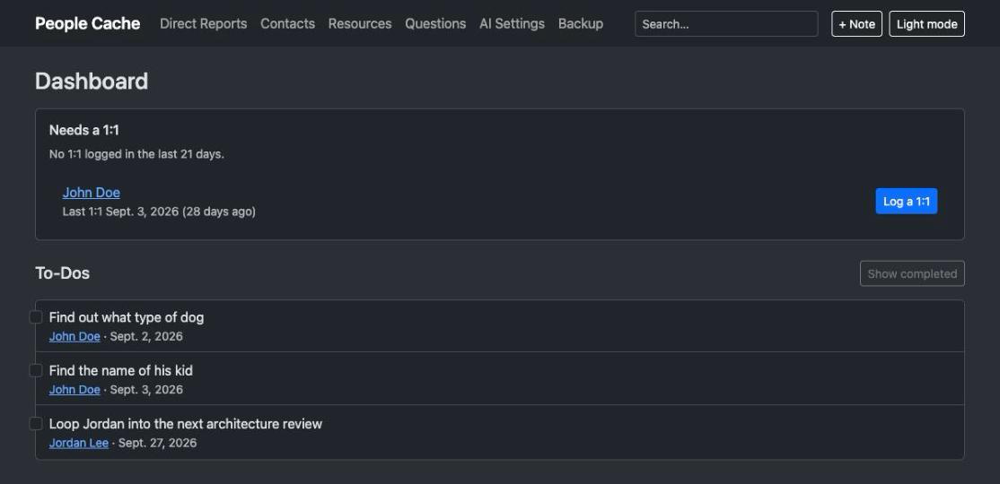
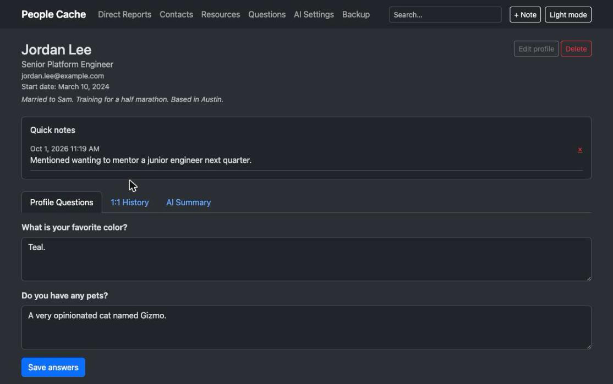
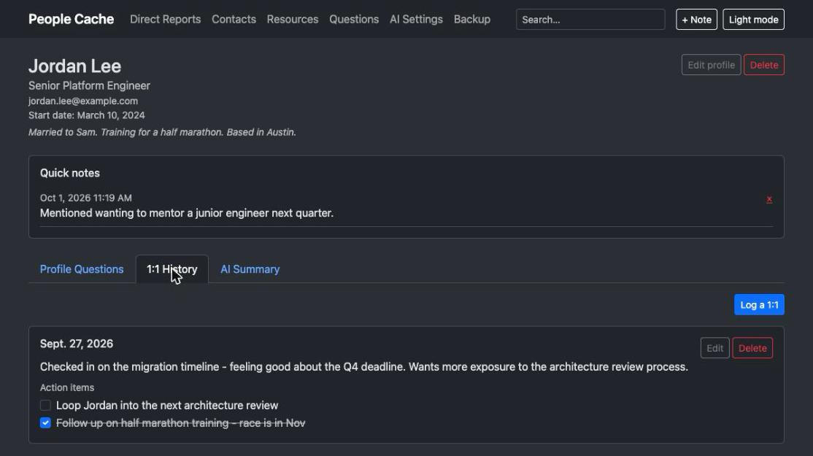
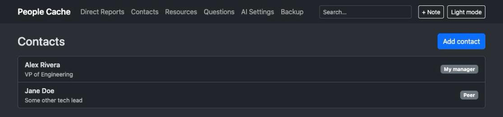
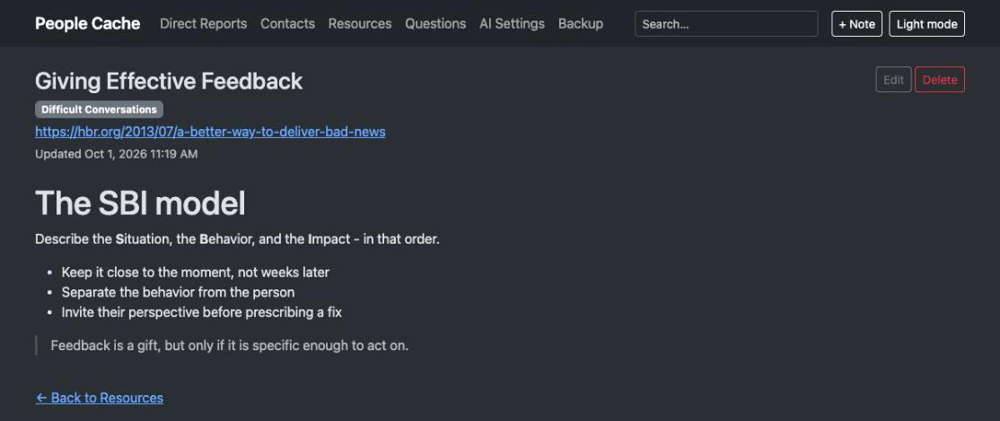
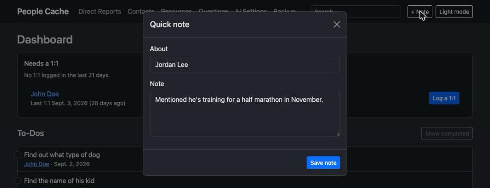
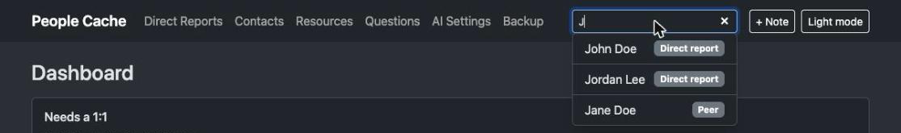

# People Cache

*Because human relationships shouldn't rely on RAM.*

A small Django app for keeping track of the people around you at work: direct
reports, your manager and peers, and a running playbook of management ideas
worth remembering. Built for a single user with no login - it's meant to run
on your own machine or home server.



## Features

- **Direct Reports** - a shared bank of profile questions you answer per
  person, a dated history of 1:1 notes with action items, personal notes
  (family, interests, anything worth remembering), and an optional AI-generated
  summary or talking points via a local Ollama instance.
- **Contacts** - a lighter profile (name, relationship, title, notes) for your
  manager, peers, and anyone else you work with who isn't a direct report.
- **Resources** - a personal management playbook: titled, taggable notes
  written in Markdown, with live preview, for saving techniques, articles, and
  quotes as you come across them.
- **Dashboard** - the home page: open action items across everyone, sorted by
  date, plus a reminder of who's overdue for a 1:1.
- **Quick notes** - a "+ Note" button on every page opens a modal to jot a
  timestamped note about anyone without leaving what you're doing.
- **Search** - a nav search box finds people and resources as you type.

| Direct report profile | 1:1 history with action items |
| --- | --- |
|  |  |

| Contacts | Resources (Markdown) |
| --- | --- |
|  |  |

| Quick note capture | Search |
| --- | --- |
|  |  |

## Run it (Docker)

```
docker compose up --build
```

Then open http://localhost:8000

Data is persisted in a Docker volume (`manager_data`) as a SQLite file, so it
survives rebuilds. To reset everything: `docker compose down -v`.

## Usage

1. Go to **Questions** and define the profile questions you want to ask every
   direct report (e.g. "What motivates you?", "How do you like to receive
   feedback?").
2. Go to **Direct Reports** and add each person; use **Contacts** for everyone
   else you work with.
3. On a report's page, fill in answers under **Profile Questions**, and log
   dated notes with optional action items under **1:1 History**.
4. Use the **+ Note** button from anywhere to jot a quick note about someone,
   and **Resources** to start building up a management playbook.
5. Optionally, go to **AI Settings** and point it at an Ollama instance to
   enable AI-generated summaries and talking points per direct report.

An admin site is also available at `/admin/` if you want direct data access;
create a superuser with:

```
docker compose exec web python manage.py createsuperuser
```

## Local development (without Docker)

```
python3 -m venv .venv
.venv/bin/pip install -r requirements.txt
.venv/bin/python manage.py migrate
.venv/bin/python manage.py runserver
```
